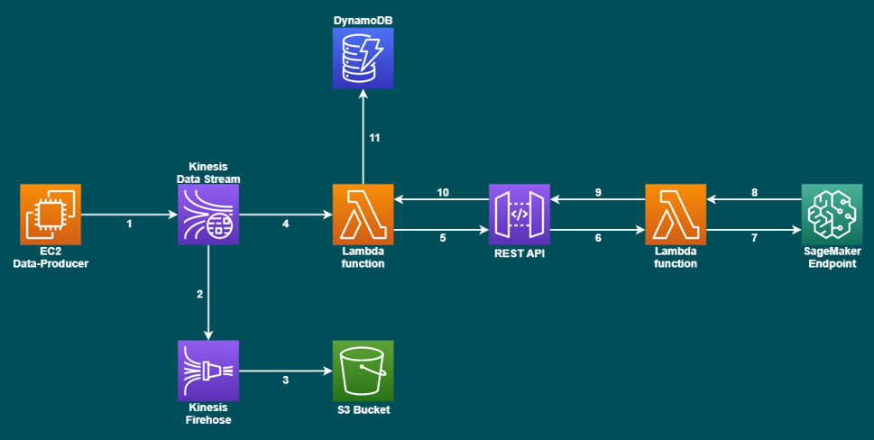
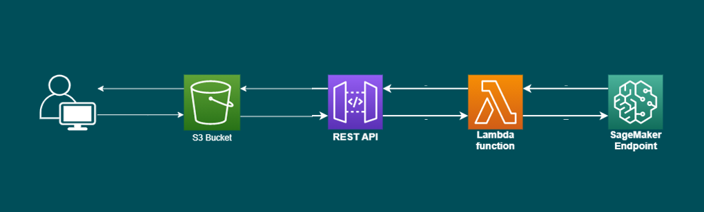

# Diamonds
This repository contains a diamond carat prediction model developed on AWS. The whole project also includes the construction of a data engineering pipeline capable of capturing requests from a Kinesis data stream topic and then forwarding them to an API Gateway connected to the model exposed by SageMaker.

The entire architecture respects the serverless paradigm and has been defined using the Terraform modules in the repository.

DyanamoDB is used to store the predictions of the diamonds and an S3 bucket stores the messages coming from the topic.

A front-end was developed to interact with the rest api using the web browser. The idea is to deploy it in an S3 bucket as showed in the following structure:

This project is part of the exam "Data: Platforms and vendor solutions" of the master 2nd level Specializing Master, AI, ML and Cloud Computing at Politecnico di Torino.
